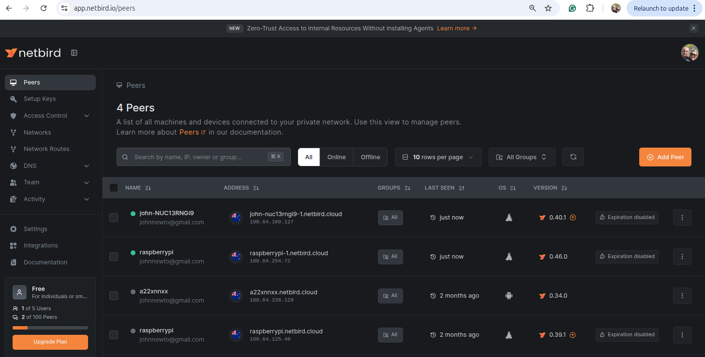

1. **Ensure Raspberry Pi OS is Up-to-Date**:
  - Use a 34-bit version of Raspberry Pi OS (Lite recommended) for compatibility.
 
2. **Install NetBird via the Installation Script**:
   - Run the official NetBird installation script:
     ```bash
     curl -fsSL https://pkgs.netbird.io/install.sh | sh
     ```
     This script automatically detects your system (including Raspberry Pi’s ARM architecture) and installs the NetBird client.[](https://docs.netbird.io/how-to/getting-started)

3. **Start and Register NetBird**:
   - For devices with a user interface, run:
     ```bash
     netbird up
     ```
     This opens a browser for SSO login to register your device with the NetBird network. Follow the prompts to sign in and confirm registration.[](https://docs.netbird.io/how-to/getting-started)

   - For headless setups (e.g., Raspberry Pi OS Lite), you can also use a setup key:
     - Log in to your NetBird account at https://app.netbird.io/, go to the **Setup Keys** section, create a new key, and copy it.
     - Run:
       ```bash
       netbird up --setup-key <PASTE_YOUR_KEY_HERE>
       ```
       Replace `<PASTE_YOUR_KEY_HERE>` with the key from the dashboard.[](https://docs.netbird.io/how-to/getting-started)

4. **Verify Installation**:
   - Check the NetBird service status:
     ```bash
     sudo netbird status
     ```
   - Confirm your Raspberry Pi appears in the NetBird dashboard under the **Peers** tab.[](https://docs.netbird.io/how-to/getting-started)


After installation, your Raspberry Pi should be connected to the NetBird network, allowing secure peer-to-peer communication. If you encounter issues, check the NetBird Docs (https://docs.netbird.io) or reach out to their support.[](https://docs.netbird.io/how-to/installation)


## Managing Peers
Monitor and manage connected devices via the Netbird dashboard:
- [Netbird Peers](https://app.netbird.io/peers)



To ensure persistent connections:
1. Log in to [Netbird Dashboard](https://app.netbird.io/peers)
2. Find your peer in the list
3. Click on the peer to expand details
4. Toggle off "Expiration" to keep the connection permanent

## Troubleshooting
