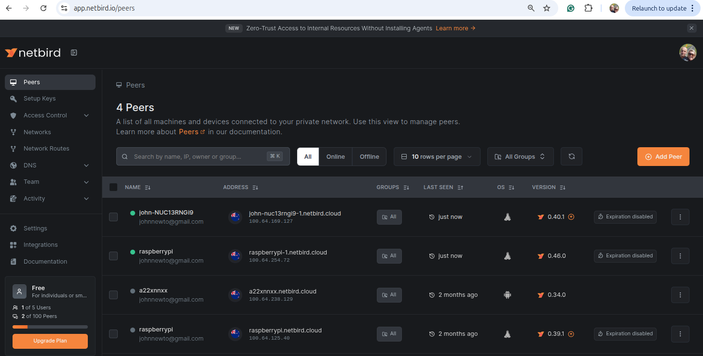

# Autonomous Starlink-Powered R/C Boat

Control your R/C boat from anywhere using Starlink Mini and MAVLink! This project leverages a Raspberry Pi or Ubuntu system with `mavlink-router` and Netbird for seamless, global connectivity to your autonomous boat.

## Overview

The **Starlink Mini** revolutionizes the R/C hobby by enabling low-latency, high-bandwidth control over long distances. This repository, `mavlink-anywhere`, provides a setup to route MAVLink packets over a Starlink connection using `mavlink-router` and Netbird for secure networking.

## Prerequisites

- Raspberry Pi or Ubuntu system
- Starlink Mini with active connection
- Netbird account for VPN setup
- QGroundControl (QGC) installed on your control device (laptop or Android)
- Git installed (`sudo apt-get install git`)

## Installation

### 1. Setup Raspberry Pi

#### Download and Install Raspberry Pi Imager
1. Download Raspberry Pi Imager from [raspberrypi.com/software](https://www.raspberrypi.com/software)
2. Install the software on your computer
3. Launch Raspberry Pi Imager

#### Configure and Flash the SD Card
1. Click "Choose OS" and select "Raspberry Pi Bullseye OS Lite (32-bit)" for headless operation
the newer 64 bit versions does not compile

2. Click "Choose Storage" and select your SD card
3. Click the gear icon (⚙️) to open advanced options:
   - Set hostname: `raspberrypi`
   - Enable SSH
   - Set username: `pi`
   - Set password: (choose a secure password)
   - Configure your WiFi credentials
4. Click "Save" and then "Write" to flash the SD card

#### First Boot and Access
1. Insert the SD card into your Raspberry Pi
2. Power on the Raspberry Pi
3. Wait 1-2 minutes for the first boot
4. Access your Raspberry Pi via SSH:
   ```bash
   ssh pi@raspberrypi.local
   ```
   If `raspberrypi.local` doesn't work, try finding the IP address using:
   ```bash
   # On Linux/macOS
   ping raspberrypi.local
   
   # Or check your router's connected devices
   ```

#### Initial Setup
After connecting, run these commands to instal git:
```bash
sudo apt install git -y
```

### 1. Clone the Repository https://github.com/alireza787b/mavlink-anywhere

```bash
git clone https://github.com/alireza787b/mavlink-anywhere.git
cd ~/mavlink-anywhere
```
### 2. Follow the Installation instuctions of [MAVLinkAnywhere](MAVLinkAnywhere.md)
Installation Script
Configuration Script

### 3. Netbird Setup: follow [NetBird](NetBird.md)
Netbird provides secure peer-to-peer networking for remote control.
get the key from the 
To install NetBird on a Raspberry Pi, follow these steps based on the latest information available:  See [NetBird](NetBird.md)

<!-- #### Install on poth pi and ground station pc
Run the following command on your Raspberry Pi or Ubuntu system:
```bash
netbird up --setup-key 49428D8A-8D99-4CF9-92BF-219F291705BC
```

#### Install Netbird as a Service
To ensure Netbird runs on boot:
```bash
sudo netbird service install --setup-key 49428D8A-8D99-4CF9-92BF-219F291705BC
sudo systemctl enable netbird
sudo systemctl start netbird
```

#### Check Netbird Status
```bash
sudo systemctl status netbird
```

#### Run Netbird on Control Device
Install and run Netbird on your laptop or Android device with the same setup key:
```bash
netbird up --setup-key 49428D8A-8D99-4CF9-92BF-219F291705BC
``` -->

<!-- **Note**: The current setup key is `49428D8A-8D99-4CF9-92BF-219F291705BC`. An alternative key is `E2797038-1191-4CE5-981F-3D133D204EEB`. -->

### 4. Configure QGroundControl (QGC)
Connect QGC to the boat using the Netbird-provided hostname and port:
- **Connection URL**: `raspberrypi-1.netbird.cloud:14550`

Alternatively, use one of the following IP addresses and port based on your network configuration:
- Local network (laptop): `192.168.1.188:14550`
- Android device: `100.64.238.129:14550`
- Other endpoints: `100.64.253.183:14550`, `169.254.58.244:14550`

### 5. Monitor MAVLink Router
Check the status of `mavlink-router`:
```bash
sudo systemctl status mavlink-router
```

View real-time logs:
```bash
sudo journalctl -u mavlink-router -f
```

## Usage

1. Ensure the Starlink Mini is powered and connected.
2. Start the Netbird service on both the Raspberry Pi and your control device.
3. Launch QGC and connect to `raspberrypi.netbird.cloud:14550`.
4. Control your R/C boat from anywhere with an internet connection!

## Managing Peers
Monitor and manage connected devices via the Netbird dashboard:
- [Netbird Peers](https://app.netbird.io/peers)



To ensure persistent connections:
1. Log in to [Netbird Dashboard](https://app.netbird.io/peers)
2. Find your peer in the list
3. Click on the peer to expand details
4. Toggle off "Expiration" to keep the connection permanent


## Configure Mavlink router

The configuration script generates and updates the `mavlink-router` configuration, sets up a systemd service, and enables routing with flexible endpoint settings.

### Usage
1. **Run the configuration script:**
   ```sh
   chmod +x configure_mavlink_router.sh
   sudo ./configure_mavlink_router.sh
   ```
2. **Follow the prompts to set up UART device, baud rate, and UDP endpoints:**
   - If an existing configuration is found, the script will use these values as defaults and show them to you
   - **UART Device**: Default is `/dev/ttyS0`. This is the default serial port on the Raspberry Pi
   - **Baud Rate**: Default is `57600`. This is the communication speed between the companion computer and connected devices
   - **UDP Endpoints**: Default is `0.0.0.0:14550`. You can enter multiple endpoints separated by spaces (e.g., `100.110.200.3:14550 100.110.220.4:14550`), get these from the netbird pairs. 
   
   I think the pi should point to 
   - `0.0.0.0:14550` 
   
   and QGC Connection 
   - `Raspberrypi.netbird.cloud:14550`


You can manually edit the configuration file if needed.
Final configuration file content will be something like :
```
   [General]
   TcpServerPort=5760
   ReportStats=false

   [UartEndpoint uart]
   Device=/dev/ttyS0
   Baud=57600
   [UdpEndpoint udp1]
   Mode=normal
   Address=100.64.169.127
   Port=14550
   [UdpEndpoint udp2]
   Mode=normal
   Address=100.64.238.129
   Port=14550
```

## Troubleshooting

- **Connection Issues**: Verify Netbird is running (`sudo systemctl status netbird`) and the setup key matches on all devices.
- **MAVLink Router Errors**: Check logs with `sudo journalctl -u mavlink-router -f`.
- **QGC Fails to Connect**: Ensure the correct IP/hostname and port are used, and check firewall settings.


## License

This project is licensed under the MIT License. See the [LICENSE](LICENSE) file for details.